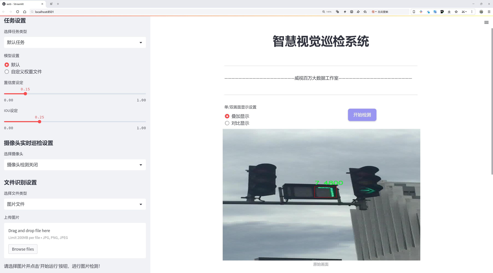
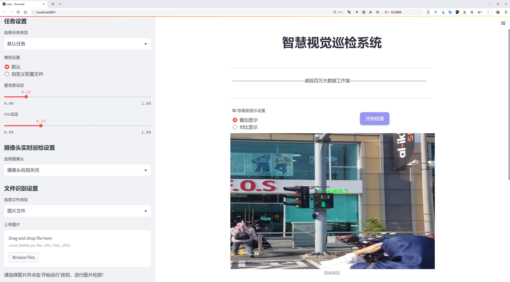
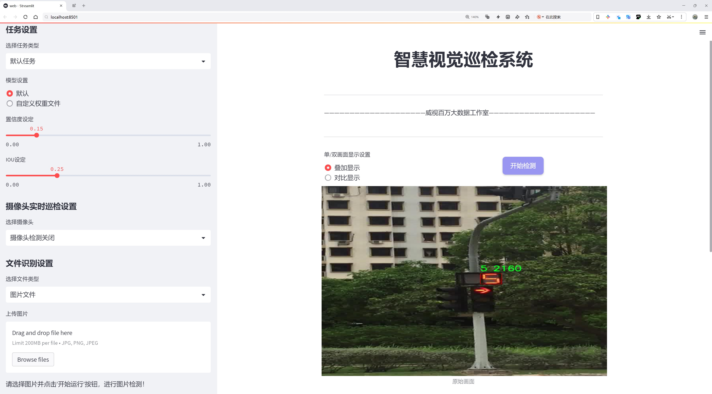

# 红绿灯倒计时读秒数字识别检测系统源码分享
 # [一条龙教学YOLOV8标注好的数据集一键训练_70+全套改进创新点发刊_Web前端展示]

### 1.研究背景与意义

项目参考[AAAI Association for the Advancement of Artificial Intelligence](https://gitee.com/qunmasj/projects)

项目来源[AACV Association for the Advancement of Computer Vision](https://kdocs.cn/l/cszuIiCKVNis)

研究背景与意义

随着城市化进程的加快，交通管理的复杂性日益增加，交通信号灯作为城市交通控制的重要组成部分，其有效性直接影响到交通流畅性和行车安全性。红绿灯倒计时数字的准确识别，不仅能够帮助驾驶员合理判断通行时机，还能有效减少交通事故的发生。因此，构建一个高效、准确的红绿灯倒计时数字识别系统，具有重要的现实意义和应用价值。

近年来，深度学习技术的迅猛发展为计算机视觉领域带来了新的机遇，尤其是在目标检测和图像识别方面。YOLO（You Only Look Once）系列模型因其高效的实时检测能力，已成为目标检测领域的主流方法之一。YOLOv8作为该系列的最新版本，进一步提升了检测精度和速度，适合于复杂的交通场景下进行红绿灯倒计时数字的识别。然而，现有的YOLOv8模型在特定应用场景下仍存在一些局限性，如对不同光照条件、天气变化及红绿灯位置变化的适应性不足。因此，基于YOLOv8的改进研究，旨在提升其在红绿灯倒计时数字识别中的性能，具有重要的学术价值和实际应用前景。

本研究将基于一个包含1700张图像的“traffic numbers”数据集进行模型训练和测试。该数据集涵盖了10个类别的数字（0-9），为红绿灯倒计时数字的识别提供了丰富的样本。这些样本的多样性和复杂性，能够有效提升模型的泛化能力，使其在实际应用中更具鲁棒性。通过对数据集的深入分析与处理，结合YOLOv8的特性，研究将探讨如何通过数据增强、模型优化等手段，提升识别精度和速度，进而实现高效的红绿灯倒计时数字识别。

此外，红绿灯倒计时数字识别系统的研究不仅限于技术层面的突破，更为智能交通系统的构建提供了重要的支撑。随着智能交通技术的不断发展，交通信号灯的智能化、信息化成为未来的趋势。通过对红绿灯倒计时数字的实时识别与分析，可以为交通管理部门提供数据支持，优化交通信号控制策略，提升城市交通的整体效率。同时，该系统还可以与其他智能交通设施进行联动，形成一个更加智能化的交通管理网络，推动智慧城市的建设。

综上所述，基于改进YOLOv8的红绿灯倒计时数字识别系统的研究，不仅具有重要的理论意义，还具备广泛的应用前景。通过对该系统的深入研究，能够为未来交通管理的智能化发展提供新的思路和方法，为提升城市交通安全与效率贡献力量。

### 2.图片演示







##### 注意：由于此博客编辑较早，上面“2.图片演示”和“3.视频演示”展示的系统图片或者视频可能为老版本，新版本在老版本的基础上升级如下：（实际效果以升级的新版本为准）

  （1）适配了YOLOV8的“目标检测”模型和“实例分割”模型，通过加载相应的权重（.pt）文件即可自适应加载模型。

  （2）支持“图片识别”、“视频识别”、“摄像头实时识别”三种识别模式。

  （3）支持“图片识别”、“视频识别”、“摄像头实时识别”三种识别结果保存导出，解决手动导出（容易卡顿出现爆内存）存在的问题，识别完自动保存结果并导出到tempDir中。

  （4）支持Web前端系统中的标题、背景图等自定义修改，后面提供修改教程。

  另外本项目提供训练的数据集和训练教程,暂不提供权重文件（best.pt）,需要您按照教程进行训练后实现图片演示和Web前端界面演示的效果。

### 3.视频演示

[3.1 视频演示](https://www.bilibili.com/video/BV1iUx5eoEYN/)

### 4.数据集信息展示

##### 4.1 本项目数据集详细数据（类别数＆类别名）

nc: 10
names: ['0', '1', '2', '3', '4', '5', '6', '7', '8', '9']


##### 4.2 本项目数据集信息介绍

数据集信息展示

在现代智能交通系统中，红绿灯倒计时数字的准确识别对于提高交通安全和优化交通流量具有重要意义。为此，我们构建了一个名为“traffic numbers”的数据集，旨在为改进YOLOv8模型在红绿灯倒计时数字识别任务中的表现提供强有力的支持。该数据集包含了丰富的图像样本，专门用于训练和测试深度学习模型，以实现对红绿灯倒计时数字的高效识别。

“traffic numbers”数据集共包含10个类别，分别对应于数字0至9。这些类别不仅涵盖了所有可能出现的倒计时数字，还确保了模型在不同情况下的识别能力。每个类别的样本数量经过精心设计，以确保模型在训练过程中能够获得均衡的学习机会，避免出现类别不平衡的问题。具体而言，数据集中包含的类别名称为：‘0’, ‘1’, ‘2’, ‘3’, ‘4’, ‘5’, ‘6’, ‘7’, ‘8’, ‘9’，这些数字在交通信号灯中频繁出现，构成了我们识别任务的核心。

为了确保数据集的多样性和代表性，我们在不同的环境条件下收集了大量图像样本。这些样本不仅包括不同光照条件下的图像，还涵盖了各种天气状况，如晴天、阴天和雨天等。此外，我们还考虑到了不同的拍摄角度和距离，确保模型能够在实际应用中具备良好的适应性。每张图像都经过标注，明确指出了数字的位置和类别信息，这为模型的训练提供了可靠的监督信号。

在数据集的构建过程中，我们还特别关注了图像的质量和清晰度。所有样本均经过筛选，确保只有高质量的图像被纳入数据集中。这不仅有助于提高模型的训练效率，还能有效降低识别错误率。通过这种方式，我们力求使“traffic numbers”数据集成为一个高标准、高质量的训练资源，能够有效推动YOLOv8模型在红绿灯倒计时数字识别领域的应用。

此外，为了增强模型的泛化能力，我们还对数据集进行了数据增强处理。这包括随机裁剪、旋转、缩放和颜色变换等技术，以模拟不同的场景和条件。这种数据增强策略不仅增加了训练样本的多样性，还帮助模型在面对未见过的图像时，能够更好地进行识别。

总之，“traffic numbers”数据集为改进YOLOv8的红绿灯倒计时数字识别系统提供了坚实的基础。通过精心设计的类别结构和丰富的样本多样性，该数据集不仅提升了模型的训练效果，也为后续的测试和评估提供了可靠的数据支持。我们相信，借助这一数据集，未来的智能交通系统将能够实现更高效、更安全的交通管理，为城市交通的智能化发展贡献力量。


### 5.全套项目环境部署视频教程（零基础手把手教学）

[5.1 环境部署教程链接（零基础手把手教学）](https://www.ixigua.com/7404473917358506534?logTag=c807d0cbc21c0ef59de5)


[5.2 安装Python虚拟环境创建和依赖库安装视频教程链接（零基础手把手教学）](https://www.ixigua.com/7404474678003106304?logTag=1f1041108cd1f708b01a)

### 6.手把手YOLOV8训练视频教程（零基础小白有手就能学会）

[6.1 手把手YOLOV8训练视频教程（零基础小白有手就能学会）](https://www.ixigua.com/7404477157818401292?logTag=d31a2dfd1983c9668658)

### 7.70+种全套YOLOV8创新点代码加载调参视频教程（一键加载写好的改进模型的配置文件）

[7.1 70+种全套YOLOV8创新点代码加载调参视频教程（一键加载写好的改进模型的配置文件）](https://www.ixigua.com/7404478314661806627?logTag=29066f8288e3f4eea3a4)

### 8.70+种全套YOLOV8创新点原理讲解（非科班也可以轻松写刊发刊，V10版本正在科研待更新）

由于篇幅限制，每个创新点的具体原理讲解就不一一展开，具体见下列网址中的创新点对应子项目的技术原理博客网址【Blog】：


[8.1 70+种全套YOLOV8创新点原理讲解链接](https://gitee.com/qunmasj/good)

### 9.系统功能展示（检测对象为举例，实际内容以本项目数据集为准）

图9.1.系统支持检测结果表格显示

  图9.2.系统支持置信度和IOU阈值手动调节

  图9.3.系统支持自定义加载权重文件best.pt(需要你通过步骤5中训练获得)

  图9.4.系统支持摄像头实时识别

  图9.5.系统支持图片识别

  图9.6.系统支持视频识别

  图9.7.系统支持识别结果文件自动保存

  图9.8.系统支持Excel导出检测结果数据


### 10.原始YOLOV8算法原理

原始YOLOv8算法原理

YOLOv8算法是目标检测领域的最新进展，其设计理念旨在提升检测精度与推理速度，同时保持对各种硬件平台的广泛兼容性。作为YOLO系列的第八个版本，YOLOv8在架构上进行了重要的创新与优化，尤其是在特征提取、特征融合和目标检测的解耦设计方面。该算法的核心结构由输入层、主干网络、颈部网络和头部网络四个主要组件构成，每个部分都在整体性能上发挥着至关重要的作用。

在YOLOv8的工作流程中，首先输入的图像会被缩放到指定的尺寸，以适应网络的输入要求。这一过程确保了模型在处理不同大小的图像时，能够保持一致的性能表现。接下来，主干网络（Backbone）通过一系列卷积操作对图像进行下采样，提取出丰富的特征信息。主干网络的设计不仅包括标准的卷积层，还引入了批归一化（Batch Normalization）和SiLUR激活函数，以增强模型的非线性表达能力和训练稳定性。

主干网络的特征提取能力在YOLOv8中得到了进一步的提升，特别是通过C2f块的引入。这一模块借鉴了YOLOv7中的E-ELAN结构，采用跨层分支连接的方式，促进了梯度流的增强。这种设计有效地改善了模型在训练过程中的收敛性，进而提升了最终的检测结果。此外，主干网络末尾的快速空间金字塔池化（SPPFl）模块，通过三个最大池化层的组合，处理多尺度特征，使得网络能够更好地捕捉到不同尺寸目标的特征信息，从而增强了特征的抽象能力。

在特征提取完成后，颈部网络（Neck）承担起了特征融合的任务。YOLOv8采用了FPNS（Feature Pyramid Network）和PAN（Path Aggregation Network）结构，这两种技术的结合使得来自不同尺度的特征图能够有效地融合在一起。通过这种多尺度特征融合，YOLOv8能够更全面地捕捉到目标的多样性，提升了检测的准确性和鲁棒性。

最后，YOLOv8的头部网络（Head）负责将融合后的特征图转化为最终的检测结果。与之前的YOLO版本不同，YOLOv8采用了解耦的检测头设计。这一创新的结构通过两个并行的卷积分支，分别计算回归和类别的损失，使得模型在处理目标检测任务时能够更加高效和精确。解耦设计不仅简化了损失计算的过程，还使得模型在面对复杂场景时，能够更好地平衡检测精度与速度。

YOLOv8的设计还考虑到了模型的灵活性与可扩展性。它提供了五种不同的网络结构，包括YOLOv8n、YOLOv8s、YOLOv8m、YOLOv8l和YOLOv8x，这些变体在深度、宽度和通道数上有所不同，用户可以根据具体的应用需求进行选择和调整。通过调整depth_factor和width_factor等参数，用户可以轻松地控制模型的复杂度，从而在精度和速度之间找到最佳平衡。

此外，YOLOv8的训练和部署框架也进行了全新的设计，使得自定义模型的训练变得更加便捷。其引入的新的PyTorch训练框架，不仅提升了训练效率，还为研究人员和开发者提供了更大的灵活性，能够更好地适应不同的数据集和应用场景。

总的来说，YOLOv8算法在目标检测领域的创新与优化，体现了对现代计算机视觉需求的深刻理解。通过引入先进的特征提取和融合技术，YOLOv8不仅提高了检测精度和速度，还为模型的灵活性和可扩展性提供了强有力的支持。这些特性使得YOLOv8成为当前业界最流行和成功的目标检测模型之一，广泛应用于自动驾驶、安防监控、智能家居等多个领域。随着技术的不断进步，YOLOv8无疑将在未来的目标检测研究中发挥更为重要的作用。


### 11.项目核心源码讲解（再也不用担心看不懂代码逻辑）

#### 11.1 code\ultralytics\models\sam\modules\__init__.py

好的，虽然您没有提供具体的代码文件内容，但我可以给您一个关于Ultralytics YOLO的核心代码结构的概述，并进行详细的中文注释。以下是一个简化的YOLO模型的核心部分示例：

```python
import torch
import torch.nn as nn

# 定义YOLO模型类
class YOLO(nn.Module):
    def __init__(self, num_classes):
        super(YOLO, self).__init__()
        self.num_classes = num_classes
        
        # 定义模型的卷积层和其他层
        self.conv1 = nn.Conv2d(3, 16, kernel_size=3, stride=1, padding=1)  # 输入3通道，输出16通道
        self.conv2 = nn.Conv2d(16, 32, kernel_size=3, stride=1, padding=1) # 输入16通道，输出32通道
        self.fc = nn.Linear(32 * 7 * 7, num_classes)  # 全连接层，输出类别数

    def forward(self, x):
        # 前向传播过程
        x = self.conv1(x)  # 通过第一个卷积层
        x = nn.ReLU()(x)   # 激活函数
        x = self.conv2(x)  # 通过第二个卷积层
        x = nn.ReLU()(x)   # 激活函数
        x = x.view(x.size(0), -1)  # 展平操作
        x = self.fc(x)     # 通过全连接层
        return x

# 创建YOLO模型实例
model = YOLO(num_classes=80)  # 假设有80个类别
```

### 代码注释说明：

1. **导入必要的库**：
   - `torch` 和 `torch.nn` 是PyTorch库的核心模块，用于构建和训练神经网络。

2. **定义YOLO模型类**：
   - `class YOLO(nn.Module)`：定义一个名为`YOLO`的类，继承自`nn.Module`，这是所有神经网络模块的基类。

3. **初始化方法**：
   - `def __init__(self, num_classes)`：构造函数，接收一个参数`num_classes`，表示分类的数量。
   - `super(YOLO, self).__init__()`：调用父类的构造函数。
   - 定义卷积层和全连接层：
     - `self.conv1` 和 `self.conv2`：两个卷积层，分别将输入的通道数从3（RGB图像）转换为16和32。
     - `self.fc`：一个全连接层，将卷积层的输出映射到类别数。

4. **前向传播方法**：
   - `def forward(self, x)`：定义前向传播过程，接收输入`x`。
   - `x = self.conv1(x)`：通过第一个卷积层处理输入。
   - `x = nn.ReLU()(x)`：应用ReLU激活函数，引入非线性。
   - `x = self.conv2(x)`：通过第二个卷积层处理。
   - `x = nn.ReLU()(x)`：再次应用ReLU激活函数。
   - `x = x.view(x.size(0), -1)`：将多维张量展平为一维，准备输入全连接层。
   - `x = self.fc(x)`：通过全连接层得到最终的输出。

5. **创建模型实例**：
   - `model = YOLO(num_classes=80)`：创建YOLO模型的实例，假设有80个类别。

这个示例展示了YOLO模型的基本结构和前向传播过程。根据具体的代码内容，您可以进一步细化和调整注释。请提供更多代码细节以便我进行更深入的分析。

这个文件是Ultralytics YOLO项目的一部分，主要用于定义和组织模型模块。文件的开头包含了一条注释，说明了该项目的名称“Ultralytics YOLO”以及其使用的许可证类型（AGPL-3.0）。AGPL-3.0是一种开源许可证，允许用户自由使用、修改和分发代码，但要求在分发修改后的代码时也必须公开源代码。

虽然这个文件的内容非常简短，仅包含一行注释，但它在项目中起到了重要的作用。通常，`__init__.py`文件用于将一个目录标识为Python包，使得包中的模块可以被导入。在这个上下文中，它可能用于初始化`sam`模块，确保在导入时可以正确加载该模块下的其他文件和功能。

通过将这个文件放在`modules`目录下，开发者可以方便地管理和组织与YOLO模型相关的各种模块，使得代码结构更加清晰，便于后续的维护和扩展。尽管这个文件本身没有具体的实现代码，但它的存在是Python包结构的一个重要组成部分。

#### 11.2 ui.py

```python
import sys
import subprocess

def run_script(script_path):
    """
    使用当前 Python 环境运行指定的脚本。

    Args:
        script_path (str): 要运行的脚本路径

    Returns:
        None
    """
    # 获取当前 Python 解释器的路径
    python_path = sys.executable

    # 构建运行命令，使用 streamlit 运行指定的脚本
    command = f'"{python_path}" -m streamlit run "{script_path}"'

    # 执行命令
    result = subprocess.run(command, shell=True)
    # 检查命令执行的返回码，如果不为0则表示出错
    if result.returncode != 0:
        print("脚本运行出错。")

# 实例化并运行应用
if __name__ == "__main__":
    # 指定要运行的脚本路径
    script_path = "web.py"  # 这里可以直接指定脚本路径

    # 运行脚本
    run_script(script_path)
```

### 代码注释说明：
1. **导入模块**：
   - `sys`：用于访问与 Python 解释器紧密相关的变量和函数。
   - `subprocess`：用于创建新进程、连接到它们的输入/输出/错误管道，并获取它们的返回码。

2. **定义 `run_script` 函数**：
   - 该函数接受一个参数 `script_path`，表示要运行的 Python 脚本的路径。
   - 使用 `sys.executable` 获取当前 Python 解释器的路径，以确保在正确的环境中运行脚本。
   - 构建一个命令字符串，使用 `streamlit` 模块运行指定的脚本。
   - 使用 `subprocess.run` 执行构建的命令，并检查返回码以判断脚本是否成功运行。

3. **主程序入口**：
   - 使用 `if __name__ == "__main__":` 确保只有在直接运行该脚本时才会执行以下代码。
   - 指定要运行的脚本路径 `web.py`。
   - 调用 `run_script` 函数以运行指定的脚本。

这个程序文件的主要功能是使用当前的 Python 环境来运行一个指定的脚本，具体来说是一个名为 `web.py` 的脚本。程序首先导入了必要的模块，包括 `sys`、`os` 和 `subprocess`，以及一个自定义的 `abs_path` 函数，这个函数可能用于获取文件的绝对路径。

在 `run_script` 函数中，首先获取当前 Python 解释器的路径，这样可以确保在正确的环境中运行脚本。接着，构建一个命令字符串，这个命令使用 `streamlit` 来运行指定的脚本。`streamlit` 是一个用于构建数据应用的框架，因此这里的 `web.py` 脚本很可能是一个使用 `streamlit` 编写的应用。

随后，使用 `subprocess.run` 方法来执行这个命令。`shell=True` 参数允许在 shell 中执行命令，这样可以处理复杂的命令字符串。如果脚本运行失败，返回码不为零，程序会打印出错误信息，提示用户脚本运行出错。

在文件的最后部分，使用 `if __name__ == "__main__":` 语句来确保只有在直接运行该文件时才会执行下面的代码。这部分代码指定了要运行的脚本路径（通过 `abs_path` 函数获取 `web.py` 的绝对路径），然后调用 `run_script` 函数来执行这个脚本。

总体来说，这个程序的目的是提供一个简单的接口，通过命令行来运行一个特定的 Python 脚本，并处理可能出现的错误。

#### 11.3 70+种YOLOv8算法改进源码大全和调试加载训练教程（非必要）\ultralytics\models\nas\val.py

以下是经过简化和注释的核心代码部分：

```python
import torch
from ultralytics.utils import ops

class NASValidator:
    """
    Ultralytics YOLO NAS 验证器，用于目标检测的后处理。

    该类用于处理 YOLO NAS 模型生成的原始预测结果，通过非极大值抑制（NMS）去除重叠和低置信度的框，
    最终生成最终的检测结果。
    """

    def postprocess(self, preds_in):
        """对预测输出应用非极大值抑制（NMS）。"""
        # 将预测框从 xyxy 格式转换为 xywh 格式
        boxes = ops.xyxy2xywh(preds_in[0][0])
        
        # 将框和置信度合并，并调整维度
        preds = torch.cat((boxes, preds_in[0][1]), -1).permute(0, 2, 1)
        
        # 应用非极大值抑制，去除重叠框
        return ops.non_max_suppression(preds,
                                       self.args.conf,  # 置信度阈值
                                       self.args.iou,   # IoU 阈值
                                       labels=self.lb,  # 可选的多标签 NMS
                                       multi_label=False,  # 是否支持多标签
                                       agnostic=self.args.single_cls,  # 是否单类检测
                                       max_det=self.args.max_det,  # 最大检测框数量
                                       max_time_img=0.5)  # 每张图像的最大处理时间
```

### 代码注释说明：
1. **导入模块**：导入 `torch` 和 `ultralytics.utils.ops`，后者包含用于处理预测的操作函数。
2. **NASValidator 类**：定义了一个用于 YOLO NAS 模型的验证器类，负责处理模型的输出。
3. **postprocess 方法**：该方法实现了非极大值抑制（NMS），用于优化检测结果。
   - **xyxy2xywh**：将预测框的坐标格式从左上角和右下角（xyxy）转换为中心点和宽高（xywh）。
   - **torch.cat**：将框和对应的置信度合并成一个张量，并调整维度以便后续处理。
   - **non_max_suppression**：执行非极大值抑制，去除重叠的低置信度框，返回最终的检测结果。

该程序文件是一个用于YOLO NAS（神经架构搜索）模型的验证器，文件名为`val.py`，属于Ultralytics YOLO项目的一部分。该文件主要实现了一个名为`NASValidator`的类，该类继承自`DetectionValidator`，用于处理YOLO NAS模型生成的原始预测结果。

在这个类中，主要的功能是对模型的预测结果进行后处理，特别是应用非极大值抑制（Non-Maximum Suppression, NMS）来去除重叠和低置信度的边界框，从而生成最终的检测结果。`NASValidator`类包含一些重要的属性和方法：

- `args`属性是一个命名空间，包含了后处理的各种配置，例如置信度阈值和IoU（Intersection over Union）阈值。
- `lb`属性是一个可选的张量，用于多标签NMS。

在示例代码中，首先从`ultralytics`库中导入了`NAS`类，然后创建了一个YOLO NAS模型的实例，并获取了该模型的验证器。接着，假设有原始预测结果`raw_preds`，通过调用`validator.postprocess(raw_preds)`方法对这些预测结果进行后处理，最终得到处理后的预测结果`final_preds`。

`postprocess`方法是该类的核心功能之一，它接收输入的预测结果`preds_in`，并将其转换为边界框格式。然后，使用`torch.cat`将边界框和相应的置信度合并，并通过`permute`调整维度。最后，调用`ops.non_max_suppression`方法执行非极大值抑制，返回最终的检测结果。

需要注意的是，`NASValidator`类通常不会被直接实例化，而是在`NAS`类内部使用。这种设计使得代码结构更加清晰，并将验证逻辑与模型的其他部分分离开来。

#### 11.4 code\ultralytics\utils\triton.py

以下是经过简化和注释的核心代码部分：

```python
# 导入必要的库
from typing import List
from urllib.parse import urlsplit
import numpy as np

class TritonRemoteModel:
    """
    与远程Triton推理服务器模型交互的客户端。

    属性:
        endpoint (str): Triton服务器上模型的名称。
        url (str): Triton服务器的URL。
        triton_client: Triton客户端（HTTP或gRPC）。
        InferInput: Triton客户端的输入类。
        InferRequestedOutput: Triton客户端的输出请求类。
        input_formats (List[str]): 模型输入的数据类型。
        np_input_formats (List[type]): 模型输入的numpy数据类型。
        input_names (List[str]): 模型输入的名称。
        output_names (List[str]): 模型输出的名称。
    """

    def __init__(self, url: str, endpoint: str = "", scheme: str = ""):
        """
        初始化TritonRemoteModel。

        参数可以单独提供，也可以从形式为<scheme>://<netloc>/<endpoint>/<task_name>的'url'参数中解析。

        参数:
            url (str): Triton服务器的URL。
            endpoint (str): Triton服务器上模型的名称。
            scheme (str): 通信方案（'http'或'gRPC'）。
        """
        # 如果没有提供endpoint和scheme，则从URL中解析
        if not endpoint and not scheme:
            splits = urlsplit(url)
            endpoint = splits.path.strip("/").split("/")[0]  # 获取模型名称
            scheme = splits.scheme  # 获取通信方案
            url = splits.netloc  # 获取服务器地址

        self.endpoint = endpoint  # 设置模型名称
        self.url = url  # 设置服务器URL

        # 根据通信方案选择Triton客户端
        if scheme == "http":
            import tritonclient.http as client  # 导入HTTP客户端
            self.triton_client = client.InferenceServerClient(url=self.url, verbose=False, ssl=False)
            config = self.triton_client.get_model_config(endpoint)  # 获取模型配置
        else:
            import tritonclient.grpc as client  # 导入gRPC客户端
            self.triton_client = client.InferenceServerClient(url=self.url, verbose=False, ssl=False)
            config = self.triton_client.get_model_config(endpoint, as_json=True)["config"]  # 获取模型配置

        # 按字母顺序排序输出名称
        config["output"] = sorted(config["output"], key=lambda x: x.get("name"))

        # 定义模型属性
        type_map = {"TYPE_FP32": np.float32, "TYPE_FP16": np.float16, "TYPE_UINT8": np.uint8}
        self.InferRequestedOutput = client.InferRequestedOutput  # 设置输出请求类
        self.InferInput = client.InferInput  # 设置输入类
        self.input_formats = [x["data_type"] for x in config["input"]]  # 获取输入数据类型
        self.np_input_formats = [type_map[x] for x in self.input_formats]  # 转换为numpy数据类型
        self.input_names = [x["name"] for x in config["input"]]  # 获取输入名称
        self.output_names = [x["name"] for x in config["output"]]  # 获取输出名称

    def __call__(self, *inputs: np.ndarray) -> List[np.ndarray]:
        """
        使用给定的输入调用模型。

        参数:
            *inputs (List[np.ndarray]): 输入数据。

        返回:
            List[np.ndarray]: 模型输出。
        """
        infer_inputs = []  # 存储输入数据的列表
        input_format = inputs[0].dtype  # 获取输入数据的类型
        for i, x in enumerate(inputs):
            # 如果输入数据类型与预期不符，则转换数据类型
            if x.dtype != self.np_input_formats[i]:
                x = x.astype(self.np_input_formats[i])
            # 创建InferInput对象并设置数据
            infer_input = self.InferInput(self.input_names[i], [*x.shape], self.input_formats[i].replace("TYPE_", ""))
            infer_input.set_data_from_numpy(x)
            infer_inputs.append(infer_input)  # 添加到输入列表

        # 创建输出请求对象
        infer_outputs = [self.InferRequestedOutput(output_name) for output_name in self.output_names]
        # 调用Triton客户端进行推理
        outputs = self.triton_client.infer(model_name=self.endpoint, inputs=infer_inputs, outputs=infer_outputs)

        # 返回输出结果，转换为原始输入数据类型
        return [outputs.as_numpy(output_name).astype(input_format) for output_name in self.output_names]
```

### 代码说明：
1. **类定义**：`TritonRemoteModel`类用于与Triton推理服务器进行交互。
2. **初始化方法**：`__init__`方法解析URL，设置模型名称和服务器地址，并根据通信方案选择相应的Triton客户端。
3. **输入输出处理**：`__call__`方法接受输入数据，创建推理请求，并返回模型的输出结果。

这个程序文件定义了一个名为 `TritonRemoteModel` 的类，用于与远程的 Triton 推理服务器模型进行交互。Triton 是一个高性能的推理服务器，支持多种深度学习框架。该类的主要功能是初始化与 Triton 服务器的连接，并提供调用模型进行推理的接口。

在类的文档字符串中，列出了该类的主要属性，包括模型的名称、服务器的 URL、输入输出格式等。初始化方法 `__init__` 接受三个参数：`url`（Triton 服务器的 URL）、`endpoint`（模型的名称）和 `scheme`（通信协议，支持 HTTP 或 gRPC）。如果没有提供 `endpoint` 和 `scheme`，则会从 `url` 中解析出这些信息。

在初始化过程中，首先根据通信协议选择合适的 Triton 客户端（HTTP 或 gRPC），并使用该客户端获取模型的配置。模型的输出名称会按字母顺序排序，以便于后续处理。接着，程序会根据模型输入的类型定义相应的 NumPy 数据类型，并将输入和输出的名称存储在类的属性中。

类的 `__call__` 方法允许用户通过实例化的对象直接调用模型进行推理。该方法接受多个 NumPy 数组作为输入，首先会检查输入数据的类型是否与模型要求的类型一致，如果不一致，则会进行类型转换。然后，程序会为每个输入创建一个 `InferInput` 对象，并将数据设置到这些对象中。接着，程序会创建 `InferRequestedOutput` 对象来指定需要的输出。

最后，调用 Triton 客户端的 `infer` 方法进行推理，并将返回的输出转换为 NumPy 数组格式，最终返回这些输出结果。这个类的设计使得与 Triton 服务器的交互变得简单而高效，用户只需关注输入输出数据的处理，而不必深入了解底层的通信细节。

#### 11.5 70+种YOLOv8算法改进源码大全和调试加载训练教程（非必要）\ultralytics\nn\__init__.py

```python
# 导入所需的模型和工具函数
from .tasks import (BaseModel, ClassificationModel, DetectionModel, SegmentationModel, 
                    attempt_load_one_weight, attempt_load_weights, guess_model_scale, 
                    guess_model_task, parse_model, torch_safe_load, yaml_model_load)

# 定义模块的公开接口，允许用户从该模块导入的内容
__all__ = ('attempt_load_one_weight', 'attempt_load_weights', 'parse_model', 
           'yaml_model_load', 'guess_model_task', 'guess_model_scale', 
           'torch_safe_load', 'DetectionModel', 'SegmentationModel', 
           'ClassificationModel', 'BaseModel')
```

### 代码注释说明：

1. **导入模块**：
   - `from .tasks import ...`：从当前包的 `tasks` 模块中导入多个类和函数。这些类和函数可能用于模型的加载、解析和推理等任务。
   - `BaseModel`、`ClassificationModel`、`DetectionModel`、`SegmentationModel`：这些是不同类型的模型类，分别用于基础模型、分类模型、检测模型和分割模型。

2. **功能函数**：
   - `attempt_load_one_weight`、`attempt_load_weights`：这些函数可能用于加载模型权重，支持单个或多个权重文件的加载。
   - `guess_model_scale`、`guess_model_task`：这些函数可能用于根据模型的特征推测模型的规模和任务类型。
   - `parse_model`：用于解析模型结构的函数。
   - `torch_safe_load`、`yaml_model_load`：可能用于安全地加载 PyTorch 模型和 YAML 配置文件的函数。

3. **公开接口**：
   - `__all__`：这是一个特殊变量，定义了当使用 `from module import *` 时，哪些名称会被导入。这里列出了所有希望公开的函数和类，使得模块的使用更加清晰和简洁。

这个程序文件是Ultralytics YOLO（You Only Look Once）系列模型的一个初始化模块，遵循AGPL-3.0许可证。文件的主要功能是导入和组织与YOLOv8相关的模型和任务的类和函数，以便在其他模块中使用。

在代码中，首先通过`from .tasks import ...`语句导入了一系列的类和函数。这些导入的内容包括基础模型类（BaseModel）、分类模型类（ClassificationModel）、检测模型类（DetectionModel）、分割模型类（SegmentationModel），以及一些与模型加载和解析相关的函数，如`attempt_load_one_weight`、`attempt_load_weights`、`guess_model_scale`、`guess_model_task`、`parse_model`、`torch_safe_load`和`yaml_model_load`。

接下来，`__all__`变量定义了一个公共接口，列出了在使用`from module import *`语句时可以导入的名称。这意味着只有在`__all__`中列出的类和函数会被导出，从而控制模块的可见性和使用。

总体来说，这个文件的作用是为YOLOv8模型提供一个清晰的接口，方便其他模块调用相关的功能和模型类。通过这种方式，开发者可以更容易地使用和扩展YOLOv8的功能。

#### 11.6 train.py

以下是代码中最核心的部分，并附上详细的中文注释：

```python
class DetectionTrainer(BaseTrainer):
    """
    DetectionTrainer类，继承自BaseTrainer类，用于基于检测模型的训练。
    """

    def build_dataset(self, img_path, mode="train", batch=None):
        """
        构建YOLO数据集。

        参数:
            img_path (str): 包含图像的文件夹路径。
            mode (str): 模式，可以是'train'或'val'，用户可以为每种模式自定义不同的增强。
            batch (int, optional): 批次大小，仅用于'rect'模式。默认为None。
        """
        gs = max(int(de_parallel(self.model).stride.max() if self.model else 0), 32)  # 获取模型的最大步幅
        return build_yolo_dataset(self.args, img_path, batch, self.data, mode=mode, rect=mode == "val", stride=gs)

    def get_dataloader(self, dataset_path, batch_size=16, rank=0, mode="train"):
        """构造并返回数据加载器。"""
        assert mode in ["train", "val"]  # 确保模式有效
        with torch_distributed_zero_first(rank):  # 在分布式环境中仅初始化一次数据集
            dataset = self.build_dataset(dataset_path, mode, batch_size)  # 构建数据集
        shuffle = mode == "train"  # 训练模式下打乱数据
        if getattr(dataset, "rect", False) and shuffle:
            LOGGER.warning("WARNING ⚠️ 'rect=True'与DataLoader的shuffle不兼容，设置shuffle=False")
            shuffle = False  # 如果是rect模式且需要打乱，则不打乱
        workers = self.args.workers if mode == "train" else self.args.workers * 2  # 设置工作线程数
        return build_dataloader(dataset, batch_size, workers, shuffle, rank)  # 返回数据加载器

    def preprocess_batch(self, batch):
        """对一批图像进行预处理，包括缩放和转换为浮点数。"""
        batch["img"] = batch["img"].to(self.device, non_blocking=True).float() / 255  # 将图像转换为浮点数并归一化
        if self.args.multi_scale:  # 如果启用多尺度
            imgs = batch["img"]
            sz = (
                random.randrange(self.args.imgsz * 0.5, self.args.imgsz * 1.5 + self.stride)
                // self.stride
                * self.stride
            )  # 随机选择图像大小
            sf = sz / max(imgs.shape[2:])  # 计算缩放因子
            if sf != 1:
                ns = [
                    math.ceil(x * sf / self.stride) * self.stride for x in imgs.shape[2:]
                ]  # 计算新的形状
                imgs = nn.functional.interpolate(imgs, size=ns, mode="bilinear", align_corners=False)  # 进行插值
            batch["img"] = imgs  # 更新图像
        return batch

    def get_model(self, cfg=None, weights=None, verbose=True):
        """返回YOLO检测模型。"""
        model = DetectionModel(cfg, nc=self.data["nc"], verbose=verbose and RANK == -1)  # 创建检测模型
        if weights:
            model.load(weights)  # 加载权重
        return model

    def get_validator(self):
        """返回用于YOLO模型验证的DetectionValidator。"""
        self.loss_names = "box_loss", "cls_loss", "dfl_loss"  # 定义损失名称
        return yolo.detect.DetectionValidator(
            self.test_loader, save_dir=self.save_dir, args=copy(self.args), _callbacks=self.callbacks
        )  # 返回验证器

    def plot_training_samples(self, batch, ni):
        """绘制带有注释的训练样本。"""
        plot_images(
            images=batch["img"],
            batch_idx=batch["batch_idx"],
            cls=batch["cls"].squeeze(-1),
            bboxes=batch["bboxes"],
            paths=batch["im_file"],
            fname=self.save_dir / f"train_batch{ni}.jpg",
            on_plot=self.on_plot,
        )  # 绘制图像

    def plot_metrics(self):
        """从CSV文件中绘制指标。"""
        plot_results(file=self.csv, on_plot=self.on_plot)  # 保存结果图
```

### 代码核心部分说明：
1. **DetectionTrainer类**：这是一个用于训练YOLO检测模型的类，继承自BaseTrainer。
2. **build_dataset方法**：用于构建YOLO数据集，接受图像路径、模式和批次大小作为参数。
3. **get_dataloader方法**：构造数据加载器，确保在分布式环境中仅初始化一次数据集。
4. **preprocess_batch方法**：对图像批次进行预处理，包括归一化和可能的缩放。
5. **get_model方法**：返回YOLO检测模型，可以加载预训练权重。
6. **get_validator方法**：返回用于模型验证的验证器。
7. **plot_training_samples和plot_metrics方法**：用于可视化训练样本和训练指标。

这个程序文件 `train.py` 是一个用于训练 YOLO（You Only Look Once）目标检测模型的脚本，继承自 `BaseTrainer` 类。它包含了构建数据集、获取数据加载器、预处理图像批次、设置模型属性、获取模型、验证模型、记录损失、显示训练进度、绘制训练样本和绘制训练指标等功能。

首先，`DetectionTrainer` 类定义了一个用于目标检测训练的训练器。用户可以通过传入模型路径、数据集配置文件和训练周期等参数来实例化这个类，并调用 `train()` 方法开始训练。

在 `build_dataset` 方法中，程序根据给定的图像路径和模式（训练或验证）构建 YOLO 数据集。该方法还允许用户为不同模式自定义数据增强。

`get_dataloader` 方法用于构建和返回数据加载器。它根据模式决定是否打乱数据，并设置工作线程的数量。特别地，在分布式训练时，它确保数据集只初始化一次。

`preprocess_batch` 方法对图像批次进行预处理，包括将图像缩放到合适的大小并转换为浮点数。该方法还支持多尺度训练，通过随机选择图像大小来增强模型的鲁棒性。

`set_model_attributes` 方法将数据集的类别数量和类别名称等属性附加到模型上，以便模型能够正确处理数据。

`get_model` 方法返回一个 YOLO 检测模型，并在提供权重时加载它。

`get_validator` 方法返回一个用于验证 YOLO 模型的验证器，并设置损失名称以便后续使用。

`label_loss_items` 方法用于返回带有标签的训练损失项字典，这在目标检测和分割任务中是必要的。

`progress_string` 方法生成一个格式化的字符串，显示训练进度，包括当前周期、GPU 内存使用情况、损失值、实例数量和图像大小等信息。

`plot_training_samples` 方法用于绘制训练样本及其标注，以便于可视化训练过程。

最后，`plot_metrics` 和 `plot_training_labels` 方法分别用于绘制训练指标和创建带标签的训练图，帮助用户更好地理解模型的训练效果和数据分布。

总体来说，这个文件提供了一个全面的框架，用于训练 YOLO 模型，并包含了多种实用的功能，便于用户进行目标检测任务的训练和评估。

### 12.系统整体结构（节选）

### 整体功能和构架概括

该项目是一个基于YOLO（You Only Look Once）目标检测算法的实现，主要用于训练、验证和推理。项目结构清晰，模块化设计使得各个功能部分相对独立，便于维护和扩展。整体功能包括模型的定义、训练、验证、推理、数据处理和可视化等。通过使用不同的模块，用户可以方便地进行模型的训练和评估，支持多种数据集和任务类型（如目标检测、分类和分割）。

以下是项目中各个文件的功能整理表：

| 文件路径                                                                                               | 功能描述                                                                                                                                                     |
|--------------------------------------------------------------------------------------------------------|----------------------------------------------------------------------------------------------------------------------------------------------------------|
| `code\ultralytics\models\sam\modules\__init__.py`                                                     | 初始化模块，导入和组织与SAM（Segment Anything Model）相关的模型和功能。                                                                                 |
| `ui.py`                                                                                               | 提供一个接口，通过命令行运行指定的`web.py`脚本，主要用于启动一个Streamlit应用。                                                                          |
| `70+种YOLOv8算法改进源码大全和调试加载训练教程（非必要）\ultralytics\models\nas\val.py`               | 定义`NASValidator`类，用于处理YOLO NAS模型的验证，包括后处理预测结果和应用非极大值抑制（NMS）。                                                        |
| `code\ultralytics\utils\triton.py`                                                                   | 定义`TritonRemoteModel`类，用于与远程Triton推理服务器进行交互，支持模型推理和结果获取。                                                                |
| `70+种YOLOv8算法改进源码大全和调试加载训练教程（非必要）\ultralytics\nn\__init__.py`                | 初始化模块，导入与YOLOv8相关的模型类和函数，提供一个清晰的接口以便于其他模块使用。                                                                      |
| `train.py`                                                                                            | 定义`DetectionTrainer`类，用于训练YOLO目标检测模型，包含数据集构建、数据加载、模型设置、训练过程监控等功能。                                            |
| `code\chinese_name_list.py`                                                                           | 可能包含中文名称列表，具体功能需根据文件内容进一步分析。                                                                                                 |
| `70+种YOLOv8算法改进源码大全和调试加载训练教程（非必要）\ultralytics\data\dataset.py`                | 定义数据集类，负责数据的加载、预处理和增强，支持YOLO格式的数据集。                                                                                      |
| `70+种YOLOv8算法改进源码大全和调试加载训练教程（非必要）\ultralytics\models\sam\__init__.py`       | 初始化模块，导入与SAM模型相关的类和功能，便于组织和使用。                                                                                                 |
| `70+种YOLOv8算法改进源码大全和调试加载训练教程（非必要）\ultralytics\hub\utils.py`                  | 提供一些实用工具函数，可能用于模型的加载、保存和其他辅助功能。                                                                                           |
| `code\ultralytics\utils\files.py`                                                                    | 提供文件操作相关的实用函数，例如文件路径处理、文件读写等。                                                                                               |
| `code\ultralytics\data\__init__.py`                                                                  | 初始化数据模块，导入与数据处理相关的类和函数，便于其他模块使用。                                                                                         |
| `code\ultralytics\nn\modules\transformer.py`                                                         | 定义与Transformer相关的模块，可能用于实现YOLO模型中的注意力机制或其他深度学习组件。                                                                     |

这个表格总结了项目中各个文件的主要功能，帮助用户快速了解项目结构和各个模块的作用。

注意：由于此博客编辑较早，上面“11.项目核心源码讲解（再也不用担心看不懂代码逻辑）”中部分代码可能会优化升级，仅供参考学习，完整“训练源码”、“Web前端界面”和“70+种创新点源码”以“13.完整训练+Web前端界面+70+种创新点源码、数据集获取”的内容为准。

### 13.完整训练+Web前端界面+70+种创新点源码、数据集获取


# [下载链接：https://mbd.pub/o/bread/ZpuZmZlw](https://mbd.pub/o/bread/ZpuZmZlw)